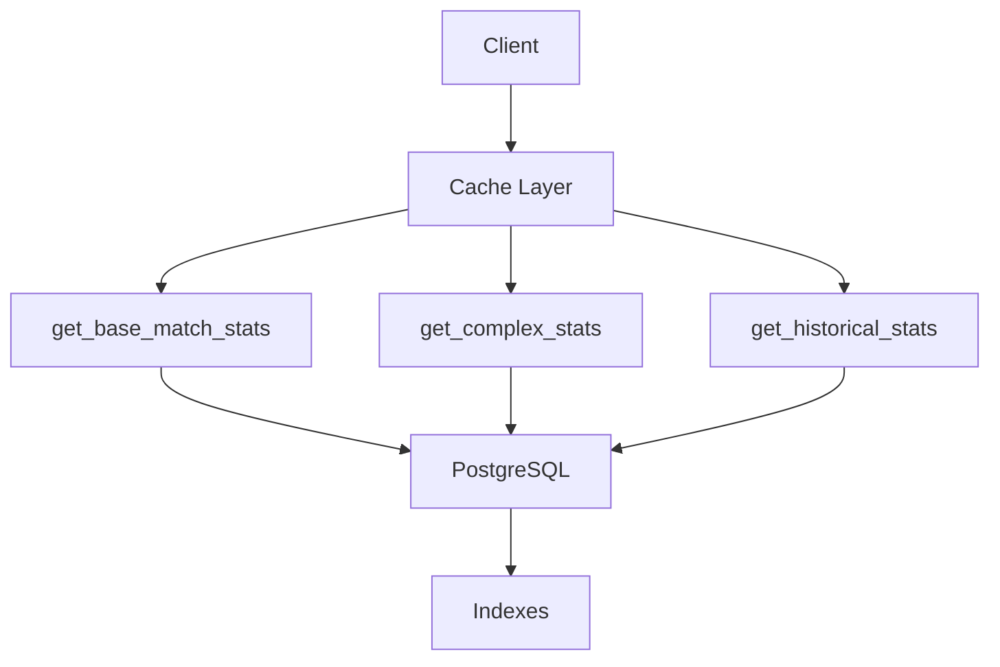

# Documentation des Fonctions Statistiques

## Vue d'ensemble

Cette documentation détaille l'architecture, l'implémentation et la maintenance des fonctions statistiques du système de baby-foot. Elle est organisée en plusieurs sections couvrant différents aspects du système.

## Structure de la Documentation

### 1. Architecture (`architecture.md`)
- Vue d'ensemble de l'architecture
- Séparation des fonctions par complexité
- Stratégies d'optimisation des performances
- Gestion des dépendances
- Scalabilité et maintenance

### 2. Stratégie de Cache (`caching-strategy.md`)
- Niveaux de cache (navigateur, Redis, base de données)
- Configuration du cache
- Stratégies de rafraîchissement
- Gestion des erreurs et fallbacks
- Monitoring et métriques

### 3. Tests (`testing.md`)
- Tests unitaires
- Tests d'intégration
- Tests de performance
- Tests de charge
- Tests de régression
- Validation des données
- Outils de test

### 4. Performance (`performance.md`)
- Optimisation des requêtes SQL
- Indexation
- Partitionnement
- Vues matérialisées
- Optimisation des fonctions
- Monitoring des performances
- Configuration du cache

### 5. Sécurité (`security.md`)
- Validation des entrées
- Sécurité des données
- Validation des résultats
- Détection des anomalies
- Journalisation et audit
- Gestion des erreurs

## Utilisation

### Installation

```bash
# Cloner le dépôt
git clone https://github.com/votre-org/babyfoot-stats.git

# Installer les dépendances
npm install

# Configurer l'environnement
cp .env.example .env
```

### Configuration

1. Configurer les variables d'environnement dans `.env`
2. Ajuster les paramètres de cache dans `config/cache.ts`
3. Configurer les seuils de performance dans `config/performance.ts`

### Développement

```bash
# Lancer les tests
npm run test

# Vérifier les performances
npm run benchmark

# Générer la documentation
npm run docs
```

## Maintenance

### Mises à jour

1. Vérifier régulièrement les mises à jour des dépendances
2. Exécuter les tests de régression après chaque mise à jour
3. Surveiller les métriques de performance

### Monitoring

1. Configurer les alertes de performance
2. Surveiller les logs d'erreurs
3. Analyser les métriques d'utilisation

## Contribution

1. Créer une branche pour les nouvelles fonctionnalités
2. Suivre les conventions de code
3. Ajouter des tests pour les nouvelles fonctionnalités
4. Mettre à jour la documentation
5. Soumettre une pull request

## Support

Pour toute question ou problème :
1. Consulter la documentation
2. Vérifier les issues existantes
3. Créer une nouvelle issue si nécessaire

## Licence

MIT License - voir LICENSE.md pour plus de détails

## Structure des Fonctions

L'architecture est divisée en trois fonctions principales, chacune optimisée pour un type spécifique de calcul :

1. [`get_base_match_stats()`](./base-match-stats.md) - Statistiques rapides en une passe
2. [`get_complex_stats()`](./complex-stats.md) - Statistiques nécessitant des calculs avancés
3. [`get_historical_stats()`](./historical-stats.md) - Statistiques basées sur l'analyse temporelle

## Index des Fichiers

- [Architecture et Performance](./architecture.md) - Vue d'ensemble de l'architecture et considérations de performance
- [Stratégie de Cache](./caching-strategy.md) - Documentation sur la stratégie de mise en cache
- [Index et Optimisations](./indexes.md) - Documentation sur les index et optimisations SQL
- [Guide de Migration](./migration-guide.md) - Guide pour migrer depuis l'ancienne fonction `get_global_stats()`
- [Guide de Maintenance](./maintenance.md) - Instructions pour la maintenance et le dépannage

## Diagramme de l'Architecture



## Quick Start

```typescript
// Exemple d'utilisation dans le frontend
const StatsDisplay = () => {
  // Chargement immédiat des stats de base
  const { data: baseStats } = useBaseStats();
  
  // Chargement différé des stats complexes
  const { data: complexStats } = useDeferredStats('complex');
  
  // Chargement à la demande des stats historiques
  const { data: historicalStats, load } = useLazyStats('historical');

  return (
    <div>
      <BasicStats data={baseStats} />
      <ComplexStats data={complexStats} />
      <button onClick={load}>
        Charger l'historique
      </button>
      {historicalStats && <HistoricalStats data={historicalStats} />}
    </div>
  );
};
``` 